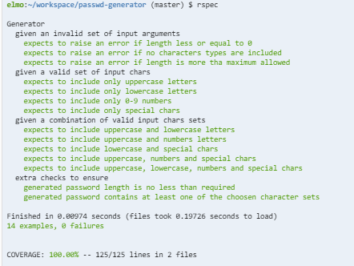
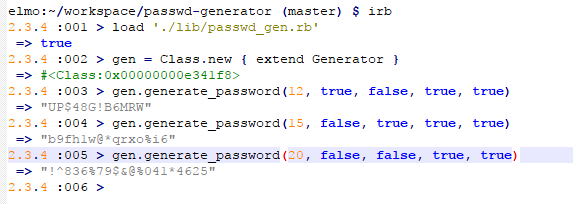

# Password Generator

## 1. Usage Instructions
* clone the repo and install the Ruby gems (for testing and code coverage gems)

```sh
$ git clone https://github.com/elenamorton/passwd-generator.git
$ cd passwd-generator
$ bundle install
```
* run tests
```sh
$ rspec
```
* test coverage



* load the module into the `irb`

We have to load the file first, and then create an object as follows `gen = Class.new { extend Generator }`. Access the `generator_password` method through the `gen` object as follows:



#### Used Technologies
* ruby 2.3.4p301
* rspec (3.6.0)
* simplecov (0.15.0)

## 2. Specification

### Headline specifications
* Allow a variable length of the generated password;
* Allow the generated password to contain uppercase chars, if chosen;
* Allow the generated password to contain lowercase chars, if chosen;
* Allow the generated password to contain any numbers 0 to 9 chars, if chosen;
* Allow the generated password to contain the `!$%&*@^` special chars, if chosen;

### User Stories extracted from the specification

```
As a user
So as I can get a secure password
I'd like to be able to set the length and character contents of the password
```

## 3. Application design

### Asumptions

### Design Decisions

### Current Limitations

### Suggested Improvements

