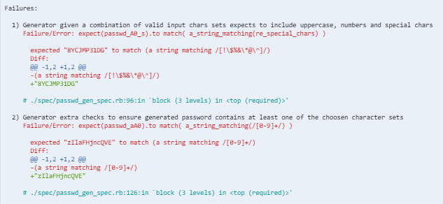

# Password Generator

## 1. Usage Instructions
* clone the repo and install the Ruby gems (for testing and code coverage gems)

```sh
$ git clone https://github.com/elenamorton/passwd-generator.git
$ cd passwd-generator
$ bundle install
```
* run tests
```sh
$ rspec
```
* test coverage


* load the module into the `irb`

We have to load the file first, and then create an object as follows `gen = Class.new { extend Generator }`. Access the `generator_password` method through the `gen` object as follows:


#### Used Technologies
* ruby 2.3.4p301
* rspec (3.6.0)
* simplecov (0.15.0)

## 2. Specification

### Headline specifications
* Allow a variable length of the generated password;
* Allow the generated password to contain uppercase chars, if chosen;
* Allow the generated password to contain lowercase chars, if chosen;
* Allow the generated password to contain any numbers 0 to 9 chars, if chosen;
* Allow the generated password to contain the `!$%&*@^` special chars, if chosen;
* Use password generator signature in Java syntax as: `String generatePassword(int length, boolean uppercase, boolean lowercase, boolean number, boolean special)`
* No dependencies on external libraries/services that could generate a password

### User Stories extracted from the specification

```
As a user
So as I can get a secure password
I'd like to be able to set the length and character set types of the password
```

## 3. Application design

### Asumptions
* The caller is specifying all five arguments in the right order when calling the password generator method.
* No invalid input parameters for the character set types.

### Design Decisions
The current design contain a `Generator` module, with a public `generator_password` method and several helper private methods.
The design tries to follow the rules for low-cost maintainable code, like: DRY code, methods with single responsibility, loose dependency by injecting arguments as a hash object in `get_password(args)`, which also encapsulates the password implementation.

### Issues encountered during implemention
* It is hard to use correctly the current `password_generator` method having so many arguments. 
> The method signature is error-prone, making easy to set the arguments in the wrong order, or with wrong values.
* The generated password is not always containing characters from all the selected sets.
> The internally generated 'full-size' password contains all characters selected. The final password, which is extracted to certain size using `.sample(args[:length])`, can miss characters of any type.
> This is noticable while running the test suite and getting errors like below.



> The closer the final password size to the internal 'full-size' password, the lower the possiblity of getting such errors.

### Suggested Improvements

